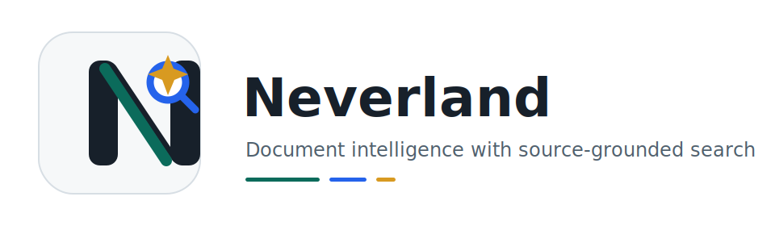
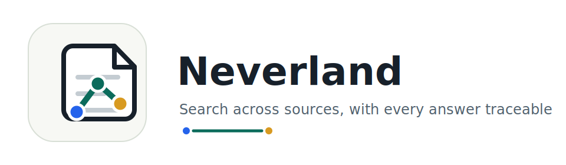
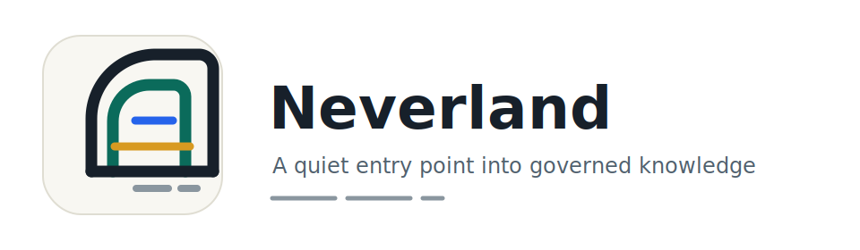

# Neverland Logo Options

These are review candidates for the user-facing Neverland UI. The final logo
should be chosen before UI Phase 00 starts so the app shell, favicon, login
screen, and navigation rail use one consistent mark.

## Option A: Compass N

Best fit when the product should feel search-first, precise, and fast. The N
shape doubles as a compact app icon, while the compass/search point hints at
navigation through a private document corpus.

## Option B: Source Lattice

Best fit when the product should emphasize connected sources, citations, and
RAG evidence. This is the most literal document-intelligence direction.

## Option C: Horizon Gate

Best fit when the product should feel calmer and more institutional. It is less
technical, with a gateway metaphor for entering governed knowledge.

## Recommendation

Option A is the strongest default for the current product direction. It reads
well at navigation-rail size, connects directly to search, and avoids making
the brand feel like a generic document repository.
